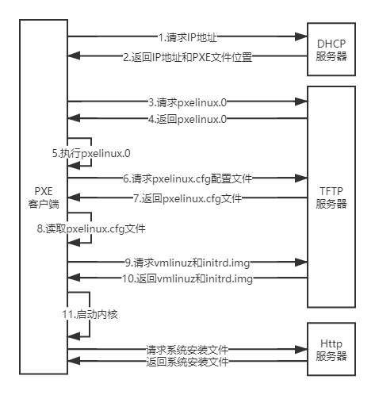

什么是 PXE？

- PXE，全名 Pre-boot Execution Environment，预启动执行环境；

- 通过网络接口启动计算机，不依赖本地存储设备（如硬盘）或本地已安装的操作系统；

- 由 Intel 和 Systemsoft 公司于 1999 年 9 月 20 日公布的技术；

PXE 的工作过程



## 准备环境

1. VirtualBox 新建虚拟机安装 CentOS 7 系统，用于搭建 PXE 服务器（这里我的 PXE 服务器 ip 是 192.168.56.101），其中：

   网卡 1 选择`网络地址转换（NAT）`连接方式：虚拟机能访问主机和公网，主机需要通过端口转发的方式才能访问虚拟机；

   网卡 2 选择`仅主机（Host-Only）网络`连接方式：主机和虚拟机能互相访问；

   VirtualBox 网络模式如下：

   | Mode      | VM→Host | VM←Host      | VM1↔VM2 | VM→Net/LAN | VM←Net/LAN   |
   | --------- | ------- | ------------ | ------- | ---------- | ------------ |
   | Host-only | +       | +            | +       | -          | -            |
   | Internal  | -       | -            | +       | -          | -            |
   | Bridged   | +       | +            | +       | +          | +            |
   | NAT       | +       | Port forward | -       | +          | Port forward |

    <!--more-->

2. 准备客户端装机镜像，CentOS/Ubuntu 都可以，比如 CentOS-7-x86_64-Minimal-1804.iso

## 搭建 PXE 服务器

### 安装 tftp 服务

1. 安装 tftp 和 xinetd；tftp 服务依赖于网络守护进程服务程序 xinetd，通过 xinetd 提供 tftp 服务

   ```bash
   yum install tftp-server xinetd -y
   ```

2. 修改 tftp 配置，默认情况下 tftp 服务是禁用的，需要修改为`disable=no`

   ```bash
   [root@localhost ~]# cat /etc/xinetd.d/tftp
   # default: off
   # description: The tftp server serves files using the trivial file transfer \
   #       protocol.  The tftp protocol is often used to boot diskless \
   #       workstations, download configuration files to network-aware printers, \
   #       and to start the installation process for some operating systems.
   service tftp
   {
        socket_type             = dgram
        protocol                = udp
        wait                    = yes
        user                    = root
        server                  = /usr/sbin/in.tftpd
        server_args             = -s /var/lib/tftpboot  #指定tftp服务的根目录
        disable                 = no #是否禁用
        per_source              = 11
        cps                     = 100 2
        flags                   = IPv4
   }
   ```

3. 安装 syslinux-tftpboot（syslinux 是一个功能强大的引导加载程序，而且兼容各种介质，syslinux 是一个小型的 Linux 操作系统，它的目的是简化首次安装 Linux 的时间，并建立修护或其它特殊用途的启动盘）

   ```bash
   yum install syslinux-tftpboot -y
   ```

   syslinux 安装完成之后，会在`/var/lib/tftpboot`目录下生成很多文件，我们接下来会使用到该目录下的`pxelinux.0,chain.c32,mboot.c32,menu.c32,memdisk`

4. 启动 xinetd，通过 xinetd 提供 tftp 服务

   ```bash
   systemctl start xinetd
   systemctl enable xinetd #设置开机启动
   ```

5. 验证 tftp 服务，需要关闭防火墙`systemctl stop firewalld`

   ```bash
   [root@localhost ~]# tftp 127.0.0.1
   tftp> get pxelinux.0
   tftp> quit
   [root@localhost ~]# ll
   -rw-r--r--. 1 root root 26759 Jul 21 10:16 pxelinux.0
   ```

   注：如果出现`Transfer timed out.`错误，需要把 selinux 禁用掉，修改配置文件`/etc/selinux/config` 将 SELINUX 设置成 disabled，然后再重启电脑

   ```bash
   [root@localhost ~]# cat /etc/selinux/config

   # This file controls the state of SELinux on the system.
   # SELINUX= can take one of these three values:
   #     enforcing - SELinux security policy is enforced.
   #     permissive - SELinux prints warnings instead of enforcing.
   #     disabled - No SELinux policy is loaded.
   #SELINUX=enforcing
   SELINUX=disabled
   # SELINUXTYPE= can take one of three two values:
   #     targeted - Targeted processes are protected,
   #     minimum - Modification of targeted policy. Only selected processes are protected.
   #     mls - Multi Level Security protection.
   SELINUXTYPE=targeted
   ```

### 复制镜像安装文件到 PXE 服务器

1. 挂载需要在客户端安装的系统镜像，比如 CentOS-7-x86_64-Minimal-1804.iso

   ```bash
   mount CentOS-7-x86_64-Minimal-1804.iso /mnt/centos7
   ```

2. 从挂载镜像目录中将可引导安装文件复制到 tftp 服务目录（vmlinuz 内核文件，initrd.img 初始化文件系统）

   ```bash
   cp /mnt/centos7/images/pxeboot/{initrd.img,vmlinuz} /var/lib/tftpboot/
   ```

3. 安装 httpd 服务，复制挂载镜像目录下的所有文件到 http 服务目录（默认是/var/www/html）

   ```bash
   yum install httpd -y

   mkdir /var/www/html/centos7
   cp -R /mnt/centos7/* /var/www/html/centos7/
   ```

4. 创建 kiskstart 文件，该文件包含了安装过程需要配置的参数信息

   ```bash
   cat > /var/www/html/ks.cfg << EOF
   # 安装系统
   install

   # 从http服务器获取安装文件
   url --url="http://192.168.56.101/centos7/"

   # 使用文本模式安装
   text

   lang en_US.UTF-8
   keyboard us

   # 系统密码
   rootpw --iscrypted $1$AdmTOr23$6kQZu85whleHaSJ.9xXlx.

   # 设置网卡
   network  --bootproto=dhcp --device=enp0s3 --ipv6=auto --activate
   network  --bootproto=dhcp --device=enp0s8 --ipv6=auto --activate

   # 配置静态ip
   #network --bootproto=static --device=enp0s3 --ip=10.0.2.15 --netmask=255.255.255.0 --gateway=10.0.2.0
   network  --hostname=localhost.localdomain

   # 安装完成后重启
   reboot

   auth --enableshadow --passalgo=sha512

   # 禁用服务
   firewall --disabled
   selinux --disabled
   firstboot --disabled

   timezone Asia/Shanghai
   logging --level=debug

   # 清除mbr引导信息
   zerombr

   # 系统引导相关配置，指定引导记录被写入mbr，append指定内核参数
   bootloader --append=" crashkernel=auto" --location=mbr --boot-drive=sda

   # 清除所有分区，initlable初始化标签磁盘分区
   clearpart --all --initlabel

   # boot分区200M
   part /boot --fstype ext4 --asprimary --size 200

   # swap分区1024M
   part swap --size 1024

   # 根分区4096M，grow使用所有可用空间
   part / --fstype ext4 --asprimary --size 4096 --grow

   %packages
   @^minimal
   @core

   %end
   EOF
   ```

   系统密码可以通过 `openssl passwd -1 "PASSWORD"` 生成，替换 `rootpw --iscrypted $1$AdmTOr23$6kQZu85whleHaSJ.9xXlx.`

5. 创建 /var/lib/tftpboot/pxelinux.cfg/default

   ```bash
    cat > /var/lib/tftpboot/pxelinux.cfg/default << EOF
    default menu.c32
        timeout 30
        menu title PXE install CentOS 7

        label linux
            menu label ^Install CentOS 7
            kernel vmlinuz
            append initrd=initrd.img ks=http://192.168.56.101/ks.cfg
    EOF
   ```

6. 启动 http 服务

   ```bash
   systemctl start httpd
   systemctl enable httpd #开机启动http服务
   ```

### 安装 dhcp 服务

1. 安装 dhcp

   ```bash
   yum install dhcp -y
   ```

2. 配置 dhcp

   ```bash
   cat > /etc/dhcp/dhcpd.conf << EOF

   # tftp服务地址和pxe引导文件名称
   next-server 192.168.56.101;
   filename "pxelinux.0";

   default-lease-time 600;
   max-lease-time 1200;
   option domain-name "pxe-server.com";
   option domain-name-servers 192.168.56.101;

   subnet 192.168.56.0 netmask 255.255.255.0 {
       range 192.168.56.120 192.168.56.254;
   }
   EOF
   ```

3. 启动 dhcp

   ```bash
   systemctl start dhcpd
   systemctl enable dhcpd #开机启动
   ```

## pxe 客户端安装测试

1. 在 virtualBox 网络管理器中禁用 DHCP 服务，这样客户端虚拟机才会请求我们搭建好的 dhcp 服务器

   

2. 新建客户端虚拟机，内存调整为 2048MB（内存太小会安装失败）

   调整启动顺序（网络启动，不用挂载镜像）

   

   启用网卡 1 选择`仅Host-Only网络`连接方式

   

   客户端向 tftp 服务器请求 pxelinux.0 文件

   

   客户端出现引导菜单

   
